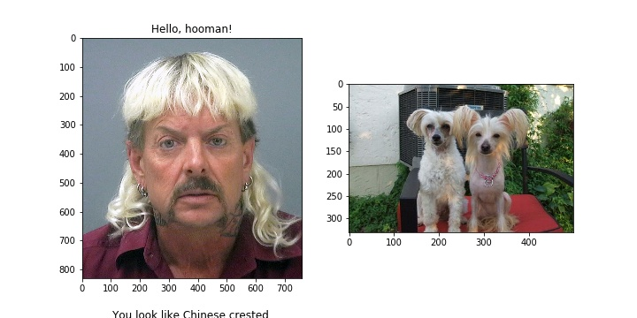
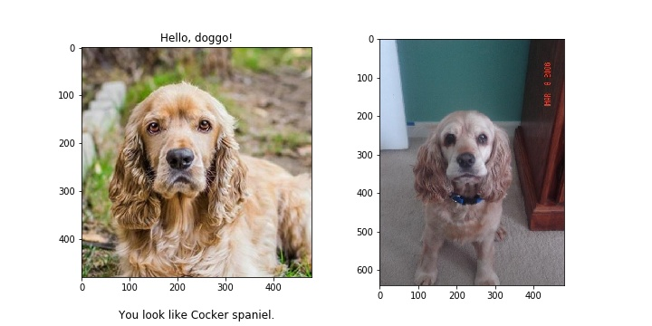

[//]: # (Image References)

[image1]: ./images/sample_dog_output.png "Sample Output"
[image2]: ./images/vgg16_model.png "VGG-16 Model Layers"
[image3]: ./images/vgg16_model_draw.png "VGG16 Model Figure"


## Convolutional Neural Networks (CNN) project: Dog Breed Classifier

Capstone Project for the Udacity ML Engineer Nanodegree Programme.

This project is devoted to building a dog breed classification app based on the Convolutional Neural Networks (CNN). The core purpose of the project is to explore the procedure of developing an end to end Machine Learning pipeline, which takes user input in form of a graphical image and returns a prediction of the dog breed. 

For the intertainment purposes, the model is also intended to be able to accept pictures of humans as an input and return the name of the dog breed the submited person on a picture resembles the most.

The core of the application is implemented in the [dog_app.ipynb](dog_app.ipynb) Jupyter Notebook.  
It accepts path to the image and returns output of a form:

- Human picture input



- Dog picture input



Detailed description can be found in [project proposal](Proposal/Proposal.pdf) document.

## How to use

1. Download the [dog dataset](https://s3-us-west-1.amazonaws.com/udacity-aind/dog-project/dogImages.zip).  Unzip the folder and place it in the repo, at location `path/to/dog-project/dogImages`.  The `dogImages/` folder should contain 133 folders, each corresponding to a different dog breed.
2. Download the [human dataset](http://vis-www.cs.umass.edu/lfw/lfw.tgz).  Unzip the folder and place it in the repo, at location `path/to/dog-project/lfw`.  If you are using a Windows machine, you are encouraged to use [7zip](http://www.7-zip.org/) to extract the folder. 
3. Instantiate the model_transfer and load pretrained parameters from ```model_transfer.pt``` file.
4. Run the app by calling ```run_app(img_path)``` function and supplying path to the image as an argument.
	
## Details


The proposed solution consists of the following steps: 

1. Identify whether dog or human is present in the picture.
2. Predict resembling dog breed with CNN model.
3. Return predicted dog breed with a sample picture.

In the **first step** two separate models are applied. Both models return binary output: True if dog (human) is present in the picture, False otherwise. If both models return False, further steps are not performed and exception is raised. Otherwise, predicted class (dog or human) is passed further.

Human detection is performed using the pretrained [Haar-cascades](https://docs.opencv.org/3.4/db/d28/tutorial_cascade_classifier.html) frontal face detection model from [OpenCV](https://pypi.org/project/opencv-python/) package. The performance of the model is then tested both on the human and dog datasets.

For the dog detection algorithm, a pretrained [VGG16](https://neurohive.io/en/popular-networks/vgg16/) implementation in [pytorch](https://pytorch.org/) is used.

At **step two** the main model is applied. A Convolutional Neutal Network is trained solely on dog data and returns one of 133 dog breeds as an output. However, it can also accept human image as an input. In this case the neural network returns the dog breed that human facial features resemble the most. 

The second and main section is devoted to building a dog breed classification model. First, a custom CNN is build from scratch via [pytorch](https://pytorch.org/) library to serve as a performance baseline. The final architecture of the model was defined during an iterative procedure of performance optimisation. It consists on 5 Convolutional layers with Max Pooling and 3 Fully Connected layers. Such techniques as Dropout and Batch Normalization have been applied to avoid overfitting. The train data has been augmented using several techniques to improve dataset diversity. 

The main dog breed classification model was built by applying transfer learning technique. A pretrained [ResNet18](https://arxiv.org/abs/1512.03385) with fixed parameters has been selected as core. An additional Linear layer with 133 outut features has been added to serve as a dog breed classifier. 

**Third step** describes UX. In this particualar problem setting, a simple printed image with predicted class is foreseen as an output. 


